# Ticketing-Microservice 🚀

Welcome to ticketing Microservice! This web application is a fantastic tool designed to Sell and buy tickets of future events.

## Technologies Used 💻

Ticketing-Microservice is built using the following technologies:

- Frontend: NextJs , Tailwindcss
- Backend: ExpressJs, Typescript, NATS Streaming Service (for messaging between services) ,
- Database: MongoDB
- environment : Docker, Kubernetes (for container orchestration)

## Images 📸

#### HOME PAGE

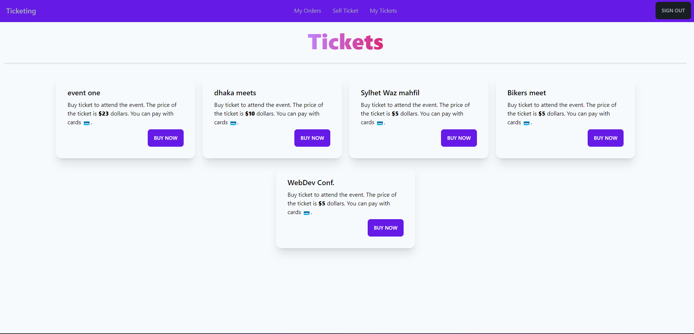

#### SIGNUP SCREEN

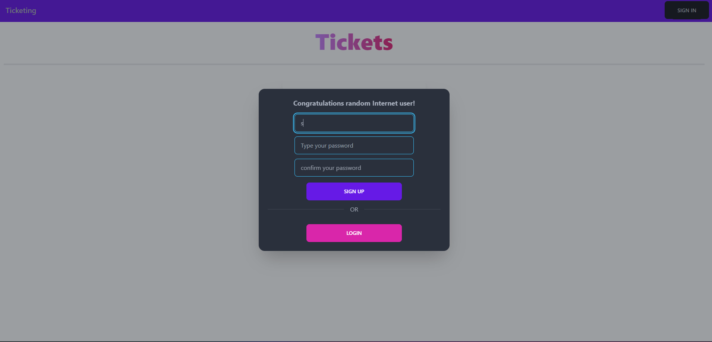

#### TICKET SELLING PAGE

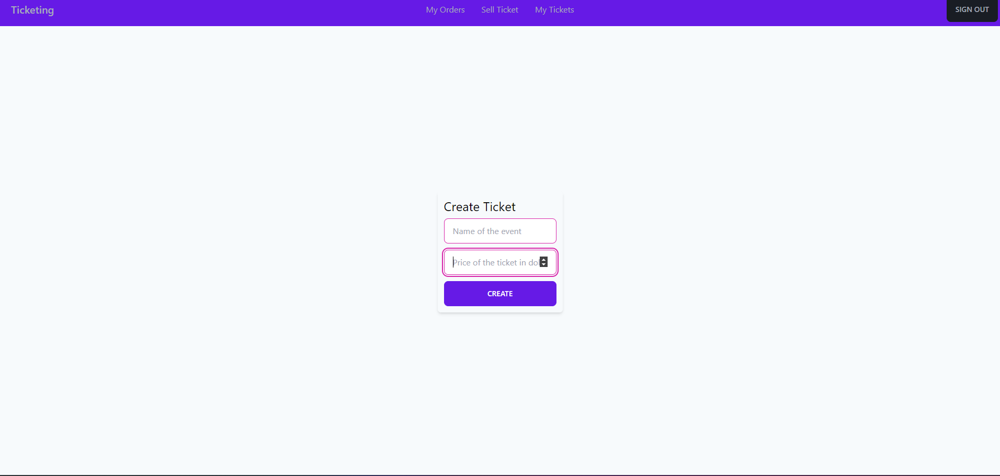

#### TICKET BUYING AND PAYMENTS

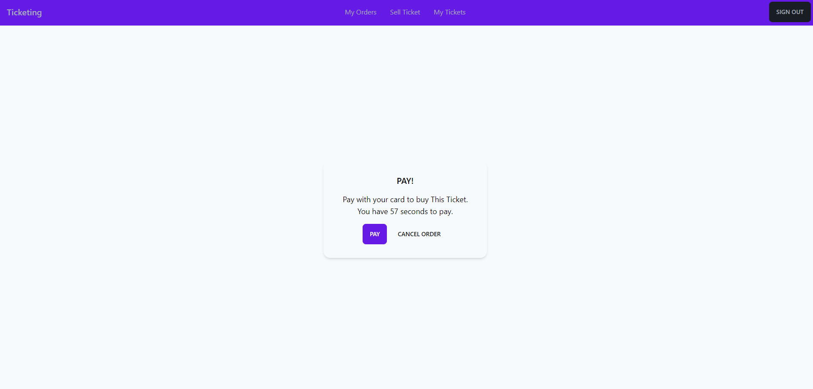
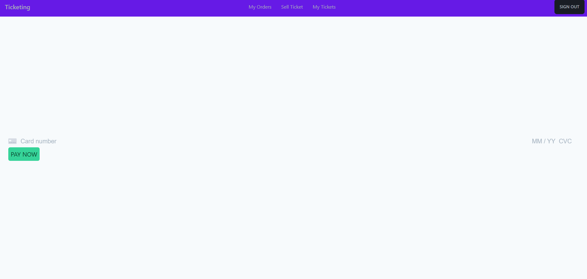

#### CURRENT STATUS OF Own tickets

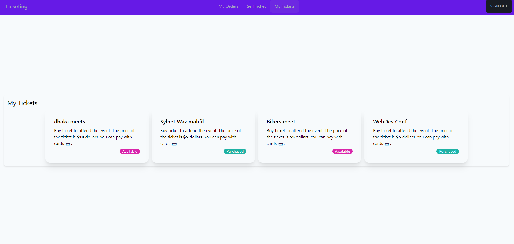

#### CURRENT STATUS OF Orders

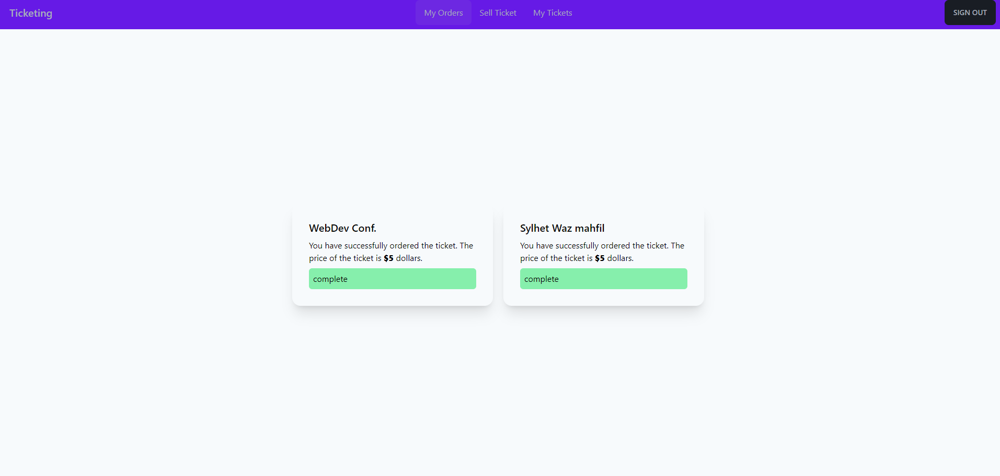

## DATA FLOW BETWEEN ALL SERVICES ➡️ 📥 ➡️

**SignIn/SignUp Flow**
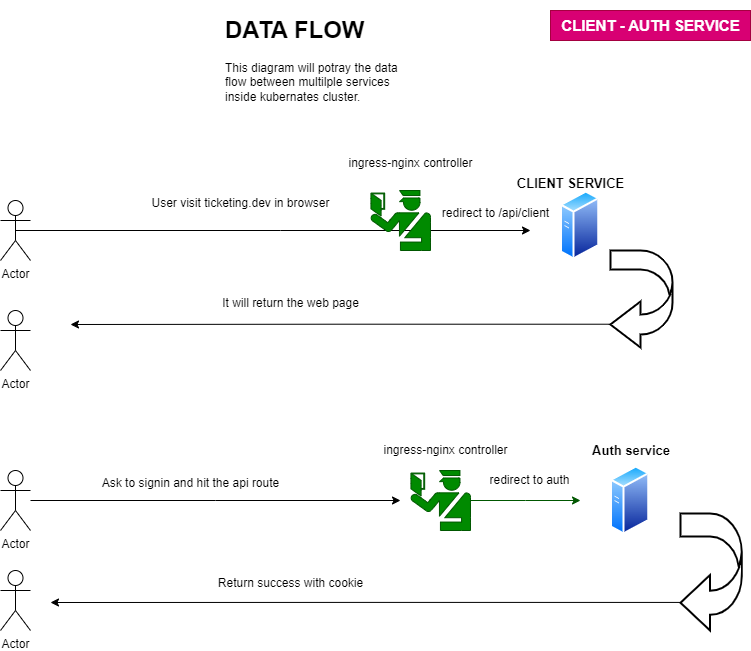

**Ticket creation flow**
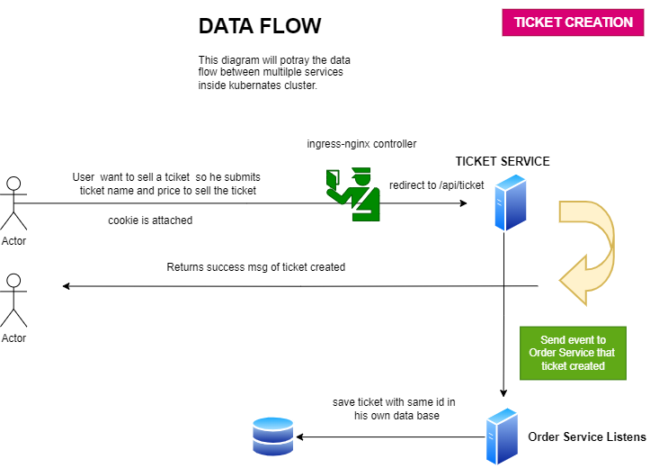

**Order creation flow**
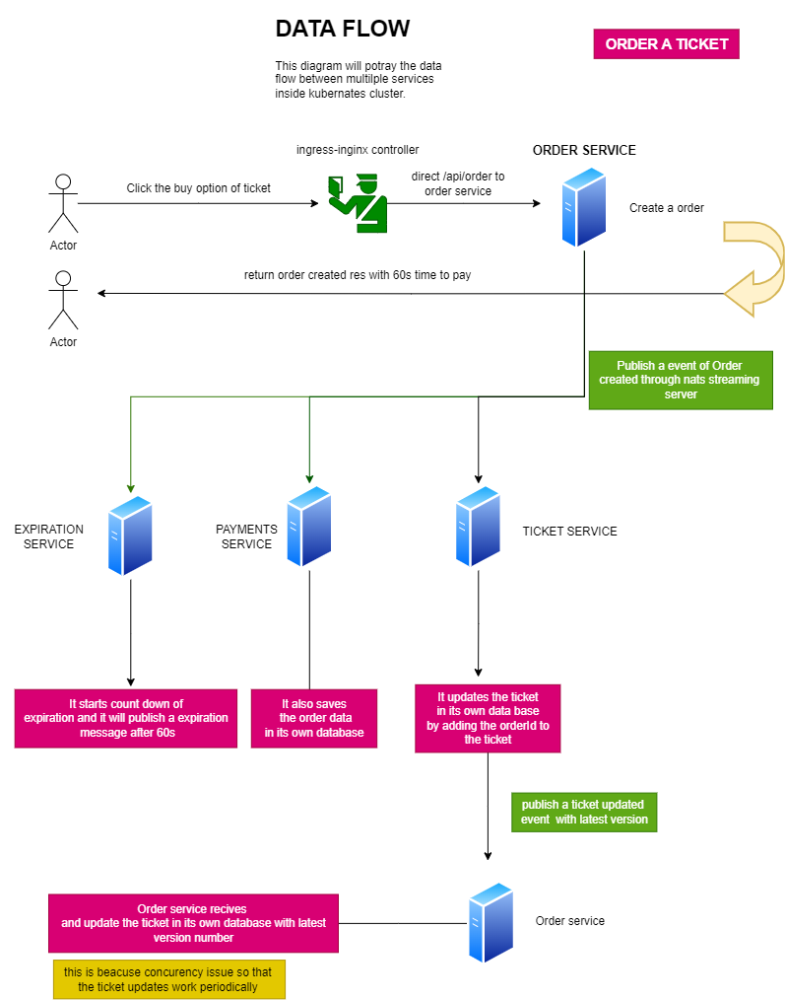

**Payment creation flow**
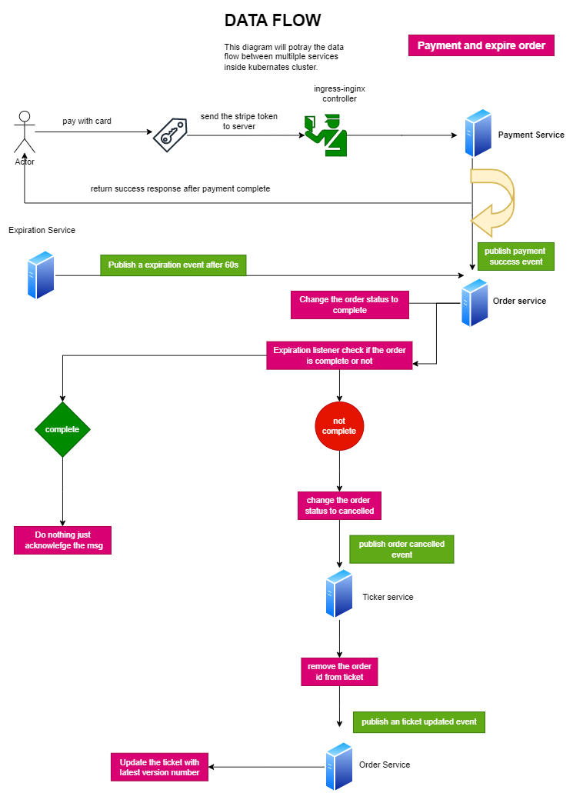

## Video 📽️

[](https://drive.google.com/file/d/1EjE3MjMN8WuzEL1libEvbXNcoARdSLFj/view?usp=sharing)

## ⚠️ Caution

Cant deploy this Kubernetes app due to a money issue. If you want to test this app, follow the steps below:

## Installation 🛠️

**_must need docker dekstop installed to run it in your machine_**

To run Ticketing app locally on your computer, follow these steps:

1. **Clone the repository:**

` https://github.com/SuhravHussen/tiecketing-microservice.git`

2. **Edit your host file , so that localhost can be directed to ticketing.dev.**

   **Windows**

   open terminal.

` notepad C:\Windows\System32\drivers\etc\hosts`

add `127.0.0.1 ticketing.dev` this line in that file and save it.

refresh dns `ipconfig /flushdns`

**Mac**

open terminal and write `sudo nano /etc/hosts` add this line `127.0.0.1 ticketing.dev `

save it and refresh dns `sudo dscacheutil -flushcache`

3. **Install skaffold Cli**

visit this site to install

`https://skaffold.dev/docs/install/`

4. **Go to ticketing-microservice folder**
5. **Create Secrets**

open command

`kubectl create secret generic my-secret --from-literal=JWT_SECRET=JWT_SECRET_VALUE`

**_Get your stripe secret and publish key from stripe account developer option_**

`kubectl create secret generic stripe-secret --from-literal=STRIPE_SECRET_KEY=STRIPE_SECRET_VALUE`

add STRIPE_PUBLISHABLE_KEY=STRIPE_PUBLISH_VALUE in client's env file. if no env file is availavle create one

```
Replce JWT_SECRET_VALUE , STRIPE_SECRET_VALUE , STRIPE_PUBLISH_VALUE with your own values
```

6. **Install Ingress-nginx controller**

` kubectl apply -f https://raw.githubusercontent.com/kubernetes/ingress-nginx/controller-v1.8.1/deploy/static/provider/cloud/deploy.yaml`

7. **Start The App**

Now just write `skaffold  dev` in command from root directory and visit `ticketing.dev`. If it shows unsafe website just write `thisisunsafe` in keyboard.
